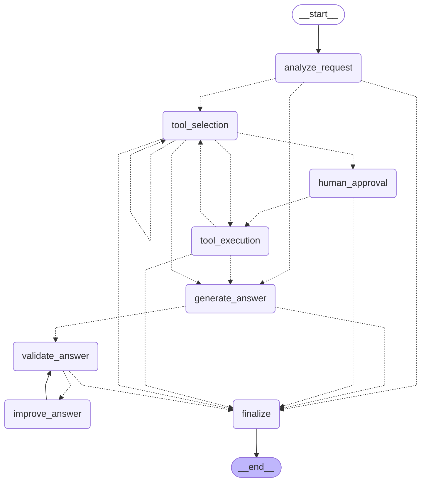

# Graph

Generated by `uv run querypilot graph`. Dashed edges are conditional.

```mermaid
---
config:
  flowchart:
    curve: linear
---
graph TD;
	__start__([<p>__start__</p>]):::first
	analyze_request(analyze_request)
	tool_selection(tool_selection)
	human_approval(human_approval)
	tool_execution(tool_execution)
	generate_answer(generate_answer)
	validate_answer(validate_answer)
	improve_answer(improve_answer)
	finalize(finalize)
	__end__([<p>__end__</p>]):::last
	__start__ --> analyze_request;
	analyze_request -.-> finalize;
	analyze_request -.-> generate_answer;
	analyze_request -.-> tool_selection;
	generate_answer -.-> finalize;
	generate_answer -.-> validate_answer;
	human_approval -.-> finalize;
	human_approval -.-> tool_execution;
	improve_answer --> validate_answer;
	tool_execution -.-> finalize;
	tool_execution -.-> generate_answer;
	tool_execution -.-> tool_selection;
	tool_selection -.-> finalize;
	tool_selection -.-> generate_answer;
	tool_selection -.-> human_approval;
	tool_selection -.-> tool_execution;
	validate_answer -.-> finalize;
	validate_answer -.-> improve_answer;
	finalize --> __end__;
	tool_selection -.-> tool_selection;
	classDef default fill:#f2f0ff,line-height:1.2
	classDef first fill-opacity:0
	classDef last fill:#bfb6fc

```
